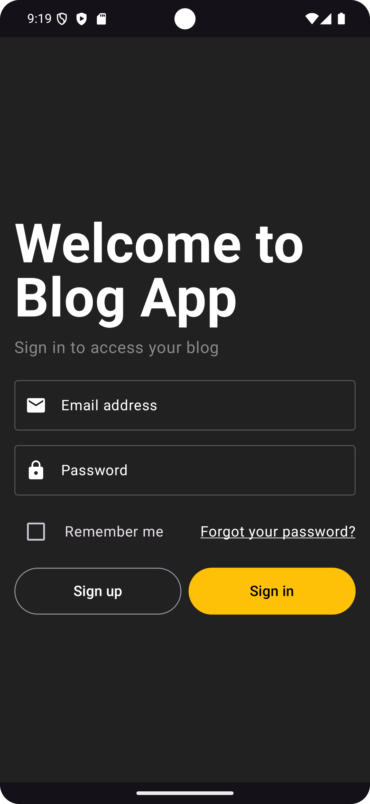
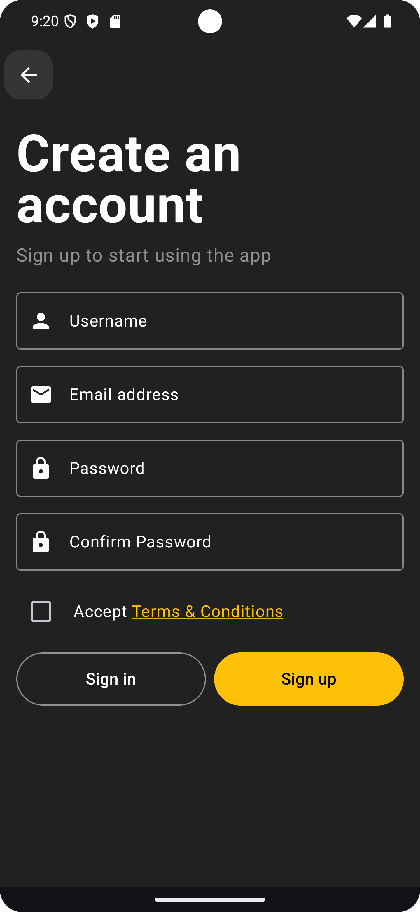
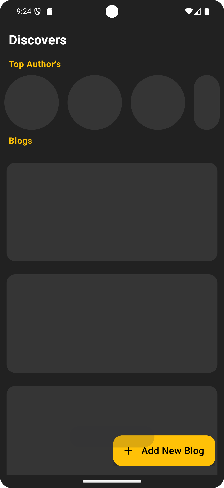
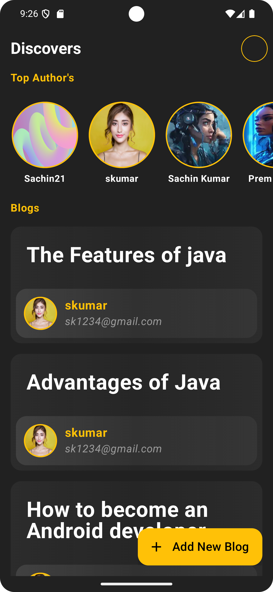
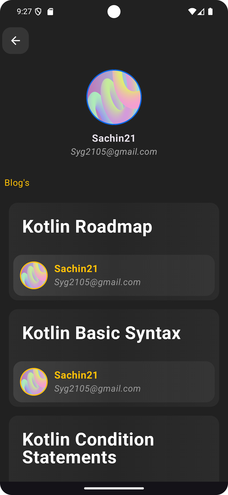
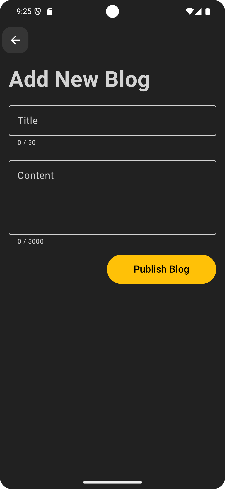
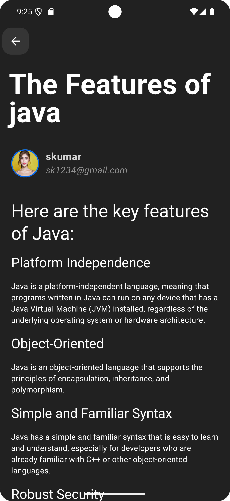

# Blog App

A simple blog where users can create, publish, and read articles.

## Features

- Authentication and authorization
- Create and publish blog posts
- Read latest blog posts

## Use Tech
- Android SDK
- Kotlin
- Retrofit
- Coroutine
- Flows
- Jetpack compose
- DataStore

## Images

